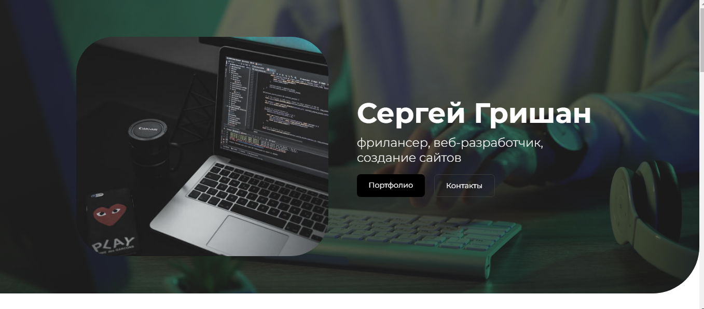

# Вёрстка простого портфолио верстальщика - разработчика.

## Задачи:
в условиях перерыва в практике вспомнить, выполнить и отработать некоторые навыки
вёрстки, оптимизации элементов файлов,
изображений и тому подобное.

# Layout of a simple portfolio of a layout designer - developer.

## Tasks:
during a break in practice, remember, perform and practice some
layout skills, optimize file elements,
images, and the like.

